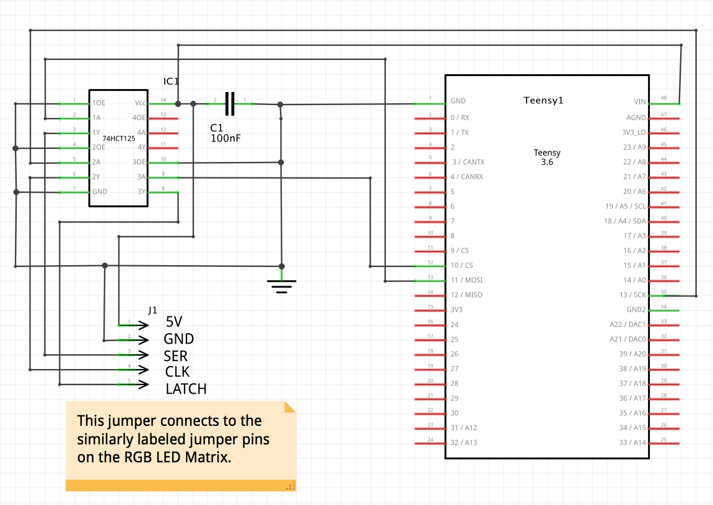
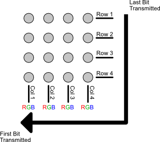

# Ardunio Driver for RGB LED Matrix

To use this driver in the Arduino IDE, add the folder `RGB_LED_Matrix_Lib` as a library as described in [this document](https://www.arduino.cc/en/Guide/Libraries). 

This driver uses SPI to transfer bits to the shift registers. 

## Arduino ATmega Boards

The default wiring for connecting the RGB LED Matrix to an Arduino using the ATmega328 micro-controller (e.g., Uno, Nano, etc) is:

| LED Matrix Connection | Arduino Uno/Nano Pin | Mega 2560 Pin | Notes |
|:-:|:-:|:-:|---|
| **+5V** | 5V | 5V | |
| **GND** | GND | GND | |
| **SER** | 11 | 51 | SPI MOSI Pin |
| **CLK** | 13 | 52 | SPI SCK Pin |
| **LATCH** | 10 | 10 | Pin 10 is default, but this can be changed when creating the `RGBLEDMatrix` object. |
| **SER**' | _unused_ | _unused_ | Used to chain multiple boards together. Would connect to the SER of the next board.|

Note that the SPI MISO pin is unused.

## 3.3v Logic Level
To use the RGB LED Matrices designed in this project with microcontroller boards that use a 3.3V logic level, you must convert the 3.3V logic signals to 5V levels to work with the shift registers. You can easily use a 74HCT125 buffer/line driver chip to do this transformation. For example, you can wire a Teensy 3.6, which is a 3.3v device, to a 74HCT125 chip in the manner shown in the diagram below to get all power and signal lines required to drive the RGB LED Matrix while the Teensy is connected to USB power:

An alternative to using this 74HCT125 circuit would be to replace the 74HC595 shift registers on the RGB LED Matrix with the 74HCT595 variety. However, this might be more expensive.

## Teensy 3.x Boards
Using the Teensy 3.x as the driving micro-controller for the RGB LED Matrix is a good choice because it's higher clock speed will allow your code to do more work without interrupting the PWM activities that are also happening at the driver level.

To use this Teensy 3.x driver in the Arduino IDE, add the folder `RGB_LED_Matrix_Lib` as a library as described in [this document](https://www.arduino.cc/en/Guide/Libraries). Also, ensure that the Arduino IDE has been updated to support Teensy development ([see here for more information](https://www.pjrc.com/teensy/td_download.html)).

## ESP8266 Boards
ESP8266 boards are generally 3.3v logic level boards. 

| LED Matrix Connection | Wemos D1 Mini | NodeMCU | Notes |
|:-:|:-:|:--:|---|
| **+5V** | 5V | Vin | |
| **GND** | GND | GND | |
| **SER** | D7 | D7 | SPI MOSI Pin |
| **CLK** | D5 | D5 | SPI SCK Pin |
| **LATCH** | D8  | D8 | SS pin | 

## Color Modes
This driver can support either 6-bit or 24-bit color. By default, this library uses 6-bit color. You can enable 24 bit color in this library by setting the preprocessor macro `TWENTY_FOUR_BIT_COLOR` to a value of 1 (note, not in your `ino` file, but at compile time for all files). You can do this either by editing the `RGBImage.h` file or setting a compiler flag. However, note that 24 bit color requires more RAM than an Arduino Uno or Nano has. Due its memory requirements, 24 bit color should work on most 32 bit boards and the Arduino Mega 2560. 24 bit color has been tested to work on the following boards:

* Teensy 3.6 
* Arduino Mega 2560
* Wemos D1 mini Lite
* NodeMCU

## Bit Layouts
This driver can support two different bit layouts. The default bit layout assumes each RGB LED is a single unit and each column is wired up with the RGB bits consecutively.  That is, for a 4x4 matrix, the bit layout would look like this:

The second supported bit layout groups all colors together in column order, then sends each color group in Red-Green-Blue order. For a 4x4 matrix, the bit layout would look like this:

When constructing the the `RGBLEDMatrix` object, the fourth argument is optional and it take a `RGBLEDBitLayout` enum value indicating which bit layout you are using. This argument defaults to `INDIVIDUAL_LEDS`, which is the first layout described above. The other potential value is `RGB_GROUPS`.
