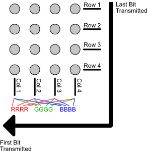

# Arduino Driver for Shift Register LED Matrices

This library provides a generalized API to create and drive an image on LED matrix where shift registers, such as the 74HC595 or DM13a, are used to control the rows and columns of the matrix. Both single color and RGB LED matrices are supported. To use this driver in the Arduino IDE, add the folder `ShiftRegisterLEDMatrixLib` as a library as described in [this document](https://www.arduino.cc/en/Guide/Libraries), or install via the libraries manager in the Arduino IDE.

This driver uses SPI to transfer bits to the shift registers and uses one timer interrupt.

Find at more about this library and hardware that it is designed for at:
[www.kamprath.net/led-matrix/](http://www.kamprath.net/led-matrix/)

# Design and Usage
## Hardware Design
The general hardware design of the matrix is to use shift registers to drive the matrix. This library can support either common anode or common cathode RGB LEDs, but default settings assume common anode. 

Consider the following 4x4  matrix using common anode RGB LEDs as an example:

```
                 Serial Bit Stream
                          |
 RGB--RGB--RGB--RGB- R1  LSB
 |||  |||  |||  |||       | 
 RGB--RGB--RGB--RGB- R2   |
 |||  |||  |||  |||       |
 RGB--RGB--RGB--RGB- R3   |
 |||  |||  |||  |||       |
 RGB--RGB--RGB--RGB- R4   |
 |||  |||  |||  |||       |
 CCC  CCC  CCC  CCC       |
 000  000  000  111       |
 123  456  789  012       |
                          |
 MSB <--------------------+
```

In this example, the RGB LED common anodes are connected into rows, and the cathodes are connected into columns aligned with the colors of each LED. To light any particular LED color, its row should be powered and the column sinked. If common cathode LEDs were used instead, this would be swapped with the rows becoming sinks and the columns being power source. The shift registers are connected in serial such that the most significant bit (MSB) being the first LED column and the least significant bit (LSB) being the first row.

Since there are 16 bits needed to control the rows and columns, two 74HC595 shift registers will be used. The first one, U1, will contain the MSB, which will be the first bit shifted out. Give that, U1 should be a downstream slave to U2 and the MSB ultimately will reside in the Q7 pin of U1. U1's SER pin will need to be connected to the SER' (aka Q7') pin on U2. The input serial stream flows into U2, so the LSB will be on Q0 of U2.

In this case, Q7 of the first 74HC595 (U1) would be attached to C01, Q6 to C02, and so on. Since there are 12 column and 4 rows, two 8-bit shift registers are needed. So the second 74HC595 (U2) would have its Q0 through Q3 attached to R1 through R4, and its Q4 through Q7 attached to C12 down through C09. In this configuration, the first bit shifted out in an update cycle is for C01, and the last bit shifted out is for R1.

In this common anode set up, the rows would be "on" when the proper 74HC595 pin is in the `high` state and the column would "on" when its respective pin is in the `low` state. Basically, the shift register is sinking the columns and powering the rows. However, since the 74HC595 cannot source enough power to drive the multiple LEDs in the row, you might use a PNP transistor to drive the row. In this case, the row would be on if the its pin on the 74HC595 is `low`, which turns on the PNP transistor allowing current to flow. 

Other similar designs can be used with this library. Common variations would be:

1. Using a DM13A sink driver to drive the cathode columns. It is not recommended to us a DM13A to drive the rows for common cathode RGB LEDs due to high current needs to drive the multiple LEDs in a single row. Using DM13A chips for the columns are nice because you can forgo the current limiting resistor for each column and the DM13A does the job of limiting the current.
2. Using common cathode RGB LEDs. In this case NPN transistors would be used to sink the current for a row, and columns are sourced with the current of the high state on a 74HC595 pin. 
3. When using acommon anode RGB LEDs, you could use a source driver, such as a UDN2981, to drive a row. This would be turned on with a `high` state on the row's shift register pin.
4. Rather than ordering the column biots as alternating through R, G, and B colors, each color can be grouped together. This is convenient when using manufactored LED matrix modules that group the pins by colors rather than by columns. See [Bit Layouts](#bit-layouts).

## Library Architecture
This library has three general facets: image handling, matrix driver, and animation management.

### Image Handling
#### Glyph
A Glyph is a black and white image with no gray scale. There are two types of Glyphs, the immutable `Glyph` object and the mutable `MutableGlyph` object. The advantage of the immutable `Glyph` object is that it can be initialized with a `PROGMEM` block, thus reducing the RAM footprint for statically constructed `Glyph` objects.

There are two ways to initialize a `Glyph` object: with a bit array and with a boolean array. The bit array approach use a bit sequence as long of the Glyph's rows\*columns, and the bit sequence is stored in an appropriately sized `char` array.  If being constructed instead with a boolean array, the `bool` array should be as long os the Glyph's row\*columns size. 
#### RGBImage
A RGBImage is a color image using one of two color modes: 6 bit and 12 bit. There are two types of RGBImage object, the immutable `RGBImage` object and the mutable `MutableRGBImage` object. The advantage of the immutable `RGBImage` object is that it can be initialized with a `PROGMEM` block, thus reducing the RAM footprint for statically constructed `RGBImage` objects.

Color for the image is represented by a `RGBColorType` value. When the preprocessor macro 	`TWELVE_BIT_COLOR` is defined to `1`, `RGBColorType` will be an `unsigned int` with the following bit layout:

```
Bits   0   4   8  12  
       |---|---|---|---
       TUUURRRRGGGGBBBB

	T = transparent
	U = unused
	R = Red
	G = Green
	B = Blue
``` 
Color can easily be set in hexadecimal format, as the 2nd byte is red, the third byte is green, and the fourth byte is blue. The left most bit of the first byte is used to indicate whether the color is transparent or not. For operations that support transparency, any other color bits are ignored when the transparency bit is set. Transparency is primarily used when drawing one `RGBImage` onto another. Transparent colors will not change the color of the underlying pixel the `RGBImage` is being drawn on top of.

When the preprocessor macro `TWELVE_BIT_COLOR` is defined to `0`, `RGBColorType` will be an `unsigned char` with the following bit layout:

```
Bits   0   4
       |---|---
       TURRGGBB
       
	T = transparent
	U = unused
	R = Red
	G = Green
	B = Blue
```

An `RGBImage` can be initialized with an array of `RGBColorType` values sized to be the image's rows\*columns. 
### Matrix Driver
The matrix driver is an object that manages rendering an image on an LED matrix. It does this using a double buffer approach. The first buffer is the image that is desired to be rendered on the LED matrix. The second buffer is the bit sequences that needs to be sent to the LED matrix's shift registers to render the image. The matrix drive object uses SPI to send the bits to the shift register. Since the rows on the matrix are multiplexed when rendering, the matrix driver object will use a system clock interrupt to ensure the multiplexing is consistently timed. 

When constructing a matrix driver, you need to tell it a few details:
* The matrix's size in rows and columns
* Whether the shift registers used for controlling columns should be set to `HIGH` or `LOW` to turn on the column. 
* Whether the shift registers used for controlling rows should be set to `HIGH` or `LOW` to turn on the row
* The length of the delay that should be present between turning on each rows while multiplexing. By default, this delay is set to zero (no delay). However, if you are using slow switch for the row's power, such as a UDN2981 which has a 2 microsecond urn off time, introducing a short period of all rows being off in between each row update can eliminate LED ghosting.
* The pin which will be used to send the latch signal.

#### LEDMatrix
The `LEDMatrix` driver is used for matrices of single color LEDs. This driver uses a `MutableGlyph` as its image buffer.

#### GrayScaleLEDMatrix
The `GrayScaleLEDMatrix` driver is used for matrices of single color LEDs, but will effect a grayscale using PWM on each LED. This driver uses a `MutableGrayScaleImage` as its image buffer.

#### RGBLEDMatrix
The `RGBLEDMatrix` driver is used for matrices of RGB color LEDs. This drive uses a `MutableRGBImage` as its image buffer.

In addition to the basic options listed above, when constructing an `RGBLEDMatrix` object, you need to indicate the shift register bit layout for the RGB columns. See the [Bit Layouts](#bit-layouts) section of this document.

### Animation Management
#### TimerAction
A `TimerAction` object allows you to manage a variably timed action in a manner that does not require the use of a clock interrupt. Since timer interrupts are not used, the timing of action may not be precise, so this class should only be used for actions that are not sensitive to some variability in the action timing. The object has a `loop()` method that should be called in every call to the global `loop()` method. 
## Usage
The basic pattern of usage is:

1. Create a `LEDMatrix` or `RGBLEDMatrix` matrix object passing the appropriate arguments
1. In the global `setup()` method, call the `setup()` method of the matrix object to initialize all fields. Then call `startScanning()` on the matrix object to cause bits to be transmitted to the shift registers in the matrix. 
1. Draw to the `image()` object on the matrix object, but do call the `startDrawing()` matrix object method prior to any drawing, and balance the call with a call to `stopDrawing()` on the matrix object. These method prevent the image display on the matrix's LEDs from being altered while you are drawing to to the image buffer.
1. Call the matrix object's `loop()` method in the global `loop()` function.


# Notes
## Driver Boards
### Arduino ATmega Boards

The default wiring for connecting the RGB LED Matrix to an Arduino using the ATmega328 micro-controller (e.g., Uno, Nano, etc) is:

| LED Matrix Connection | Arduino Uno/Nano Pin | Mega 2560 Pin | Notes |
|:-:|:-:|:-:|---|
| **+5V** | 5V | 5V | |
| **GND** | GND | GND | |
| **SER** | 11 | 51 | SPI MOSI Pin |
| **CLK** | 13 | 52 | SPI SCK Pin |
| **LATCH** | 10 | 10 | Pin 10 is default, but this can be changed when creating the `RGBLEDMatrix` object. |

Note that the SPI MISO pin is unused.

### Teensy 3.x Boards
Using the Teensy 3.x as the driving micro-controller for the RGB LED Matrix is a good choice because it's higher clock speed will allow your code to do more work without interrupting the PWM activities that are also happening at the driver level.

To use this Teensy 3.x driver in the Arduino IDE, add the folder `RGB_LED_Matrix_Lib` as a library as described in [this document](https://www.arduino.cc/en/Guide/Libraries). Also, ensure that the Arduino IDE has been updated to support Teensy development ([see here for more information](https://www.pjrc.com/teensy/td_download.html)).

### ESP8266 Boards
ESP8266 boards are generally 3.3v logic level boards. 

| LED Matrix Connection | Wemos D1 Mini | NodeMCU | Notes |
|:-:|:-:|:--:|---|
| **+5V** | 5V | Vin | |
| **GND** | GND | GND | |
| **SER** | D7 | D7 | SPI MOSI Pin |
| **CLK** | D5 | D5 | SPI SCK Pin |
| **LATCH** | D8  | D8 | SS pin | 

### 3.3v Logic Level
To use the RGB LED Matrices designed in this project with micro-controller boards that use a 3.3V logic level, you must convert the 3.3V logic signals to 5V levels to work with the shift registers. You can easily use a 74HCT125 buffer/line driver chip to do this transformation. For example, you can wire a Teensy 3.6, which is a 3.3v device, to a 74HCT125 chip in the manner shown in the diagram below to get all power and signal lines required to drive the RGB LED Matrix while the Teensy is connected to USB power:


An alternative to using this 74HCT125 circuit would be to replace the 74HC595 shift registers on the RGB LED Matrix with the 74HCT595 variety. However, this might be more expensive.


## RGB LEB Matrices
### Color Modes
This driver can support either 6-bit or 12-bit color. By default, this library uses 6-bit color. You can enable 12 bit color in this library by setting the preprocessor macro `TWELVE_BIT_COLOR` to a value of 1 (note, not in your `ino` file, but at compile time for all files). You can do this either by editing the `RGBImage.h` file or setting a compiler flag. However, note that 12 bit color requires more RAM than an Arduino Uno or Nano has. Due its memory requirements, 12 bit color should work on most 32 bit boards and the Arduino Mega 2560. 12 bit color has been tested to work on the following boards:

* Teensy 3.6 
* Arduino Mega 2560
* Wemos D1 mini Lite
* NodeMCU
* Arduino Zero
* Arduino Due

### Bit Layouts
This driver can support two different bit layouts for RGB LED matrices. The default bit layout assumes each RGB LED is a single unit and each column is wired up with the RGB bits consecutively.  That is, for a 4x4 matrix, the bit layout would look like this:


The second supported bit layout groups all colors together in column order, then sends each color group in Red-Green-Blue order. For a 4x4 matrix, the bit layout would look like this:



When constructing the the `RGBLEDMatrix` object, the third argument is optional and it take a `RGBLEDBitLayout` enum value indicating which bit layout you are using. This argument defaults to `INDIVIDUAL_LEDS`, which is the first layout described above. The other potential value is `RGB_GROUPS`.
